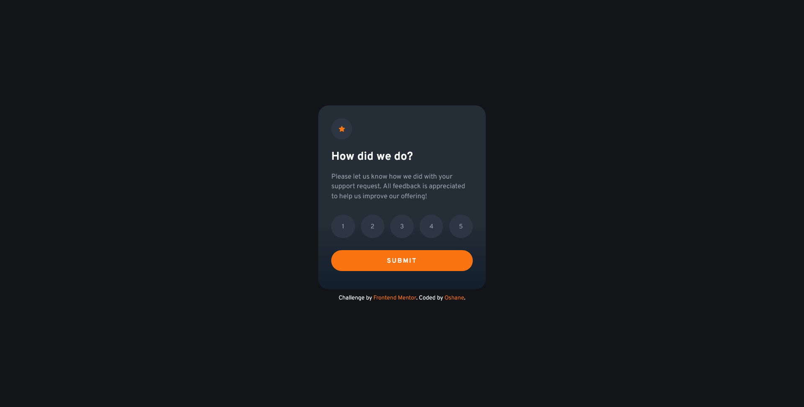
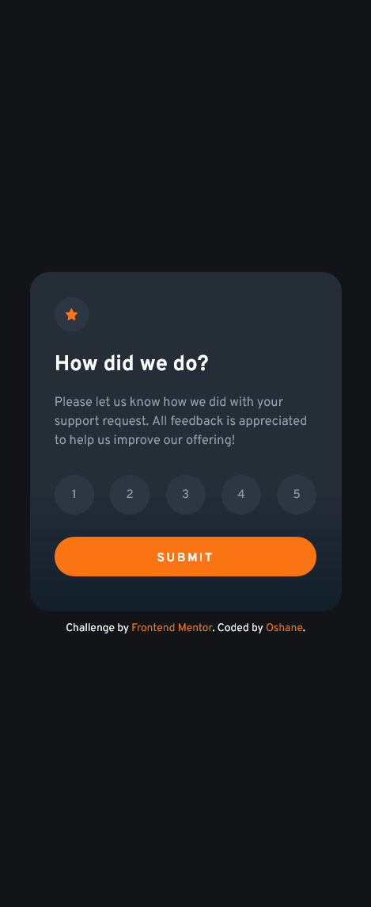

# Frontend Mentor - Interactive rating component solution

This is a solution to the [Interactive rating component challenge on Frontend Mentor](https://www.frontendmentor.io/challenges/interactive-rating-component-koxpeBUmI). Frontend Mentor challenges help you improve your coding skills by building realistic projects.

## Table of contents

- [The challenge](#the-challenge)
- [Screenshot](#screenshot)
- [Links](#links)
- [Built with](#built-with)
- [Author](#author)

### The challenge

Users should be able to:

- View the optimal layout for the app depending on their device's screen size
- See hover states for all interactive elements on the page
- Select and submit a number rating
- See the "Thank you" card state after submitting a rating

### Screenshot




### Links

- [Solution](https://github.com/Noid3ah/Interactive-rating-component)
- [Live](https://noid3ah.github.io/Interactive-rating-component)

### Built with

- Semantic HTML5 markup
- CSS custom properties
- Flexbox
- CSS Grid
- Mobile-first workflow

```html
<h1>Some HTML code I'm proud of</h1>
```

```css
.proud-of-this-css {
  color: papayawhip;
}
```

```js
buttons.forEach((btn, index) => {
  let idx = index + 1;
  btn.addEventListener("click", () => {
    rating.innerText = `You selected ${idx} out of ${buttons.length}`;
  });
});
```

## Author

- Frontend Mentor - [@noid3ah](https://www.frontendmentor.io/profile/Noid3ah)
