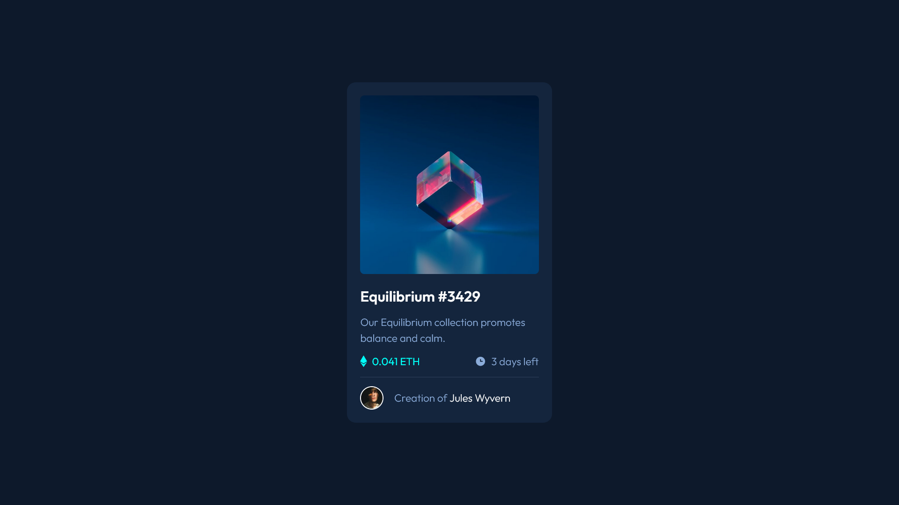
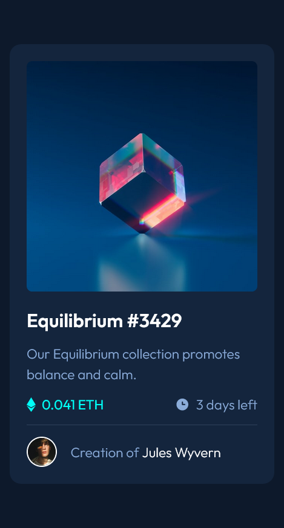

# Frontend Mentor - NFT preview card component solution

This is a solution to the [NFT preview card component challenge on Frontend Mentor](https://www.frontendmentor.io/challenges/nft-preview-card-component-SbdUL_w0U). Frontend Mentor challenges help you improve your coding skills by building realistic projects.

## Table of contents

- [The challenge](#the-challenge)
- [Screenshot](#screenshot)
- [Links](#links)
- [Built with](#built-with)
- [What I learned](#what-i-learned)
- [Continued development](#continued-development)
- [Useful resources](#useful-resources)
- [Author](#author)

### The challenge

Users should be able to:

- View the optimal layout depending on their device's screen size
- See hover and focus states for interactive elements

### Screenshot




### Links

- Solution URL: [Here](https://github.com/Noid3ah/NFT-preview-card-component)
- Live Site URL: [Here](https://noid3ah.github.io/NFT-preview-card-component)

### Built with

- Semantic HTML5 markup
- Sass variables
- Flexbox
- Mobile-first workflow

### What I learned

- How to add an overlay and display it on :hover by changing opacity.

```html
<div class="card__img">
  

  <div class="card__img__overlay">
    
  </div>
</div>
```

```scss

  .card__img__overlay {
        @include flexCenter(column);
        position: absolute;
        top: 0;
        left: 0;
        width: 100%;
        height: 100%;
        border-radius: $imgRadius;
        background-color: rgba(0, 255, 247, 0.5);
        opacity: 0;
        cursor: pointer;
        &:hover {
          opacity: 1;
        }

        img {
          width: 50px;
        }
      }
}
```

### Continued development

_I plan to continue using sass as i see it as a major improvement over regular css. I don't know how i've managed so far without it._

### Useful resources

- [How to add an overlay, on hover](https://www.youtube.com/watch?v=exb2ab72Xhs).

## Author

- Frontend Mentor - [Noid3ah](https://www.frontendmentor.io/profile/Noid3ah)
