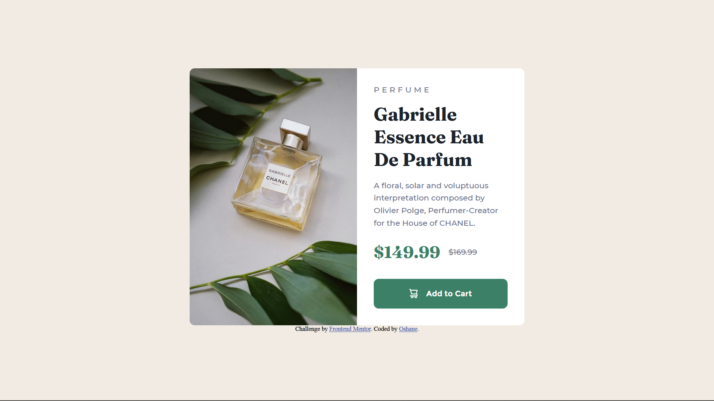
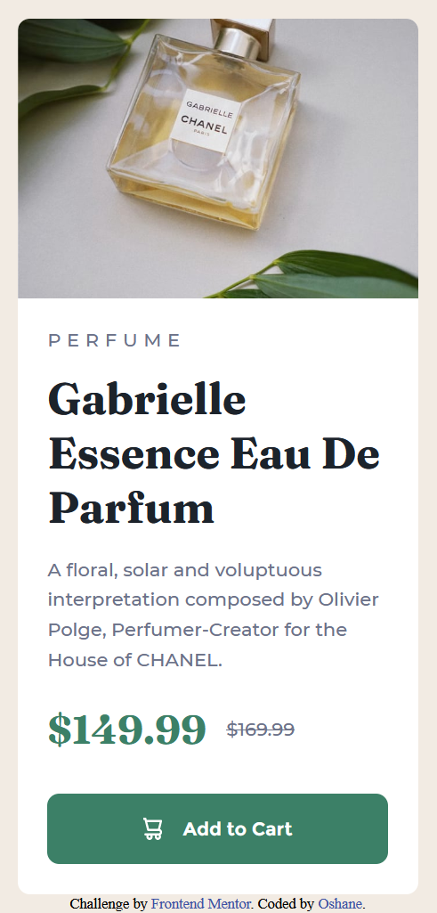

# Frontend Mentor - Product preview card component solution

This is a solution to the [Product preview card component challenge on Frontend Mentor](https://www.frontendmentor.io/challenges/product-preview-card-component-GO7UmttRfa). Frontend Mentor challenges help you improve your coding skills by building realistic projects.

## Table of contents

- [The challenge](#the-challenge)
- [Screenshot](#screenshot)
- [Links](#links)
- [Built with](#built-with)
- [What I learned](#what-i-learned)
- [Continued development](#continued-development)
- [Useful resources](#useful-resources)
- [Author](#author)

### The challenge

Users should be able to:

- View the optimal layout depending on their device's screen size
- See hover and focus states for interactive elements

### Screenshot




### Links

- Solution URL: [Add solution URL here](https://github.com/Noid3ah/Product-preview-card-component)
- Live Site URL: [Add live site URL here](https://peppy-cactus-75110c.netlify.app/)

### Built with

- Semantic HTML5 markup
- Sass variables
- Flexbox
- Mobile-first workflow

### What I learned

- Basics of Sass.
- Sass @mixins
- Sass @import
- Sass @include
- Sass variables
- Markdown basics

To see how you can add code snippets, see below:

```html
<div class="card">
  <div class="image">
    
    
  </div>

  <div class="main">
    <span class="accent--text">Perfume</span>
    <h1 class="card__header">Gabrielle Essence Eau De Parfum</h1>

    <p class="card__p">
      A floral, solar and voluptuous interpretation composed by Olivier Polge,
      Perfumer-Creator for the House of CHANEL.
    </p>

    <div class="card__price">
      <span class="price--cyan">$149.99</span>
      <span class="price--strikethrough">$169.99</span>
    </div>

    <div class="add-to-cart">
      <button class="cta btn">
         Add to
        Cart
      </button>
    </div>
  </div>
</div>
```

```scss
@mixin flexCenter($direction) {
  flex-direction: $direction;
  display: flex;
  justify-content: center;
  align-items: center;
}
```

### Continued development

_I plan to continue using sass as i see it as a major improvement over regular css. I don't know how i've managed so far without it._

### Useful resources

- [Sass crash course](https://youtu.be/Zz6eOVaaelI) - Thanks Dev Ed.

## Author

- Frontend Mentor - [Noid3ah](https://www.frontendmentor.io/profile/Noid3ah)
