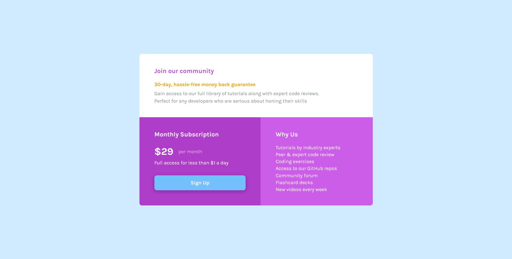

# Frontend Mentor - Base Apparel coming soon page solution

This is a solution to the [Single price grid component challenge on Frontend Mentor](https://www.frontendmentor.io/challenges/single-price-grid-component-5ce41129d0ff452fec5abbbc). Frontend Mentor challenges help you improve your coding skills by building realistic projects.

## Table of contents

- [The challenge](#the-challenge)
- [Screenshot](#screenshot)
- [Links](#links)
- [Built with](#built-with)
- [Author](#author)

### The challenge

Users should be able to:

- View the optimal layout for the component depending on their device's screen size
- See a hover state for desktop view

### Screenshot




### Links

- [Code](https://github.com/Noid3ah/FEM/tree/main/Single-price-grid-component)
- [Live](https://noid3ah.github.io/FEM/Single-price-grid-component)

### Built with

- Semantic HTML5 markup
- CSS custom properties
- Flexbox
- CSS Grid
- Mobile-first workflow

```html
<h1>Some HTML code I'm proud of</h1>
```

```css
.proud-of-this-css {
  color: papayawhip;
}
```

```js

```

## Author

- Frontend Mentor - [@Noid3ah](https://www.frontendmentor.io/profile/Noid3ah)
