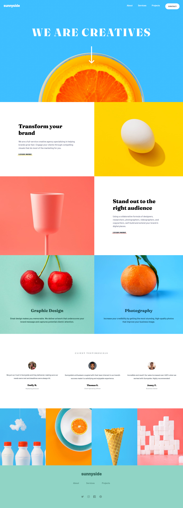
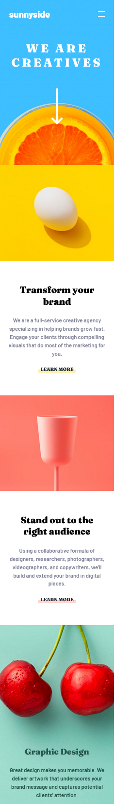
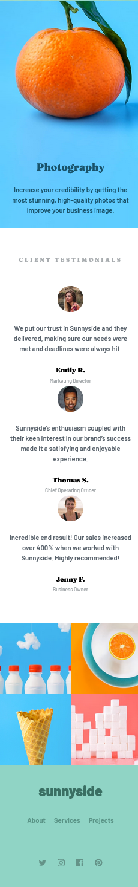

# Frontend Mentor - Sunnyside agency landing page solution

This is a solution to the [Sunnyside agency landing page challenge on Frontend Mentor](https://www.frontendmentor.io/challenges/sunnyside-agency-landing-page-7yVs3B6ef). Frontend Mentor challenges help you improve your coding skills by building realistic projects.

## Table of contents

- [The challenge](#the-challenge)
- [Screenshot](#screenshot)
- [Links](#links)
- [Built with](#built-with)
- [Author](#author)

### The challenge

Users should be able to:

- View the optimal layout depending on their device's screen size
- See hover states for all interactive elements on the page

### Screenshot





### Links

- [Solution](https://github.com/Noid3ah/Sunnyside-agency-landing-page)
- [Live Site](https://Noid3ah.github.io/Sunnyside-agency-landing-page)

### Built with

- Semantic HTML5 markup
- SCSS
- Flexbox
- Grid
- Mobile-first workflow

```css
grid-template-areas:
  "brand egg"
  "pinky stand"
  "cherry orangee"
  "testimonials testimonials"
  "block block";
```

## Author

- Frontend Mentor - [@Noid3ah](https://www.frontendmentor.io/profile/Noid3ah)
