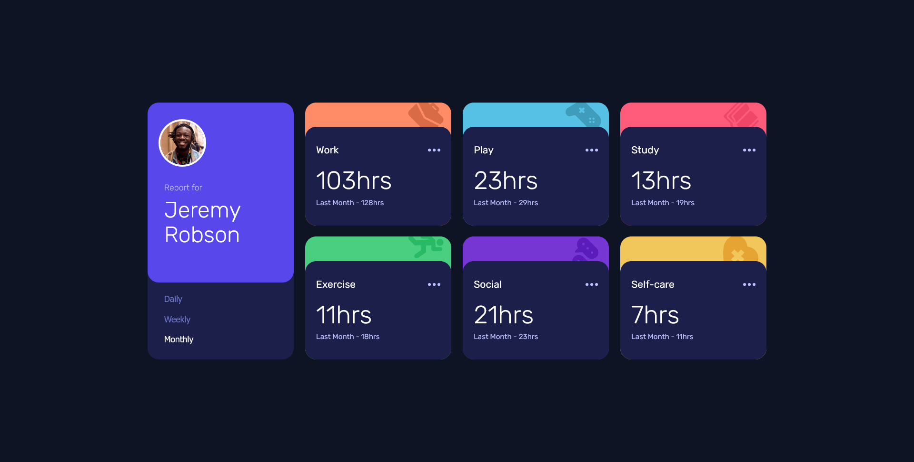
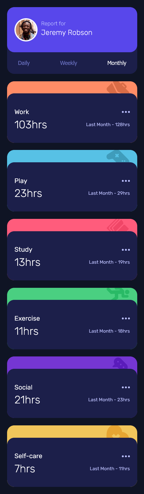

# Frontend Mentor - Time tracking dashboard solution

This is a solution to the [Time tracking dashboard solution challenge on Frontend Mentor](https://www.frontendmentor.io/challenges/time-tracking-dashboard-UIQ7167Jw). Frontend Mentor challenges help you improve your coding skills by building realistic projects.

## Table of contents

- [The challenge](#the-challenge)
- [Screenshot](#screenshot)
- [Links](#links)
- [Built with](#built-with)
- [Author](#author)

### The challenge

Users should be able to:

- View the optimal layout depending on their device's screen size
- See hover states for interactive elements

### Screenshot




### Links

- [solution](https://github.com/Noid3ah/Time-tracking-dashboard)
- [live site](https://noid3ah.github.io/Time-tracking-dashboard)

### Built with

- Semantic HTML5 markup
- CSS custom properties
- Flexbox
- CSS Grid
- Mobile-first workflow
- Javascript
```html

```

```Scss

  &:is(.work) {
    @include background-img(
      $clr_light-red--work,
      url(../images/icon-work.svg),
      93% -4%,
      60px
    );
    grid-area: work;
  }
```

```js
function getJsonData(timeframe){
  fetch('./js/data.json')
  .then((response) => response.json())
  .catch((error) =>{
    console.log(error);
  })
  .then((data) => {
    data.forEach((value, index) => {
      // Store json data in variables.
      const current = value.timeframes[timeframe].current;
      const previous = value.timeframes[timeframe].previous;

      /*
      Ids for activity cards "time and time-frame" are concurrently indexed from 0-5 matching json index.
       So card 'work', has an id of 'time-0' which will get the current hours from index 0 in json.
       */
      const hours = document.querySelector(`#time-${index}`);
      const previousTimeFrame = document.querySelector(`#time-frame-${index}`);

      switch(true){
        case timeframe == 'daily':
          hours.innerText = `${current}hrs`;
          previousTimeFrame.innerText = `Yesterday - ${previous}hrs`;
          break;

        case timeframe == 'weekly':
          hours.innerText = `${current}hrs`;
          previousTimeFrame.innerText = `Last Week - ${previous}hrs`;
          break;

        case timeframe == 'monthly':
          hours.innerText = `${current}hrs`;
          previousTimeFrame.innerText = `Last Month - ${previous}hrs`
      }
    })
  })
}
```

## Author

- Frontend Mentor - [Noid3ah](https://www.frontendmentor.io/profile/Noid3ah)
